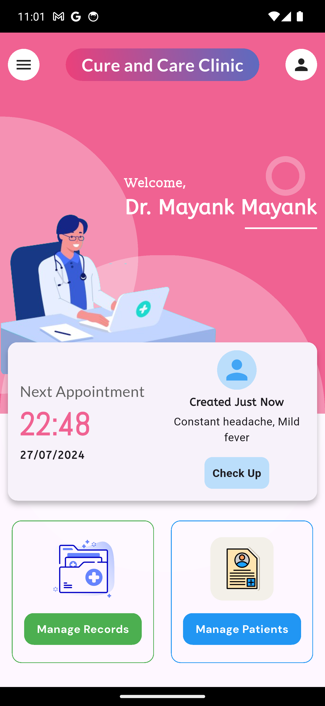
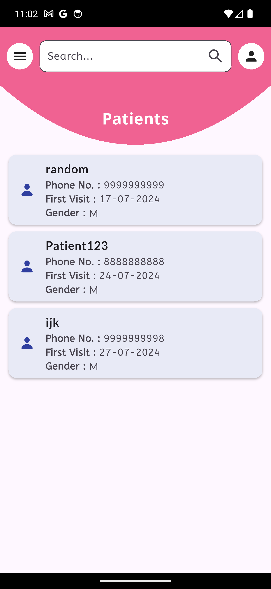
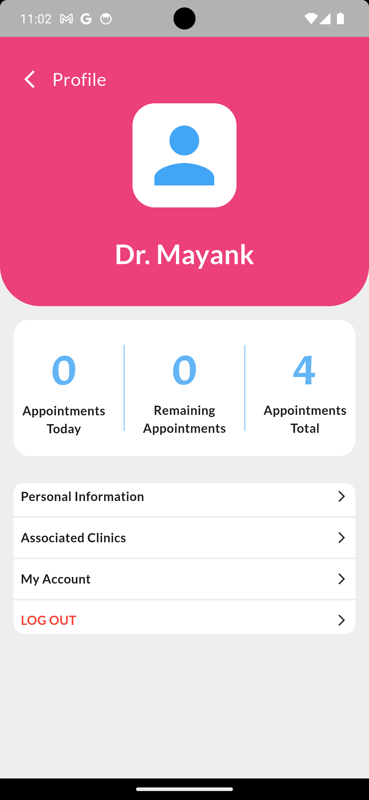
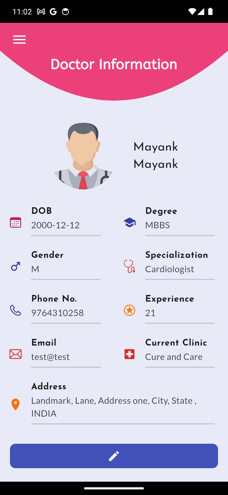
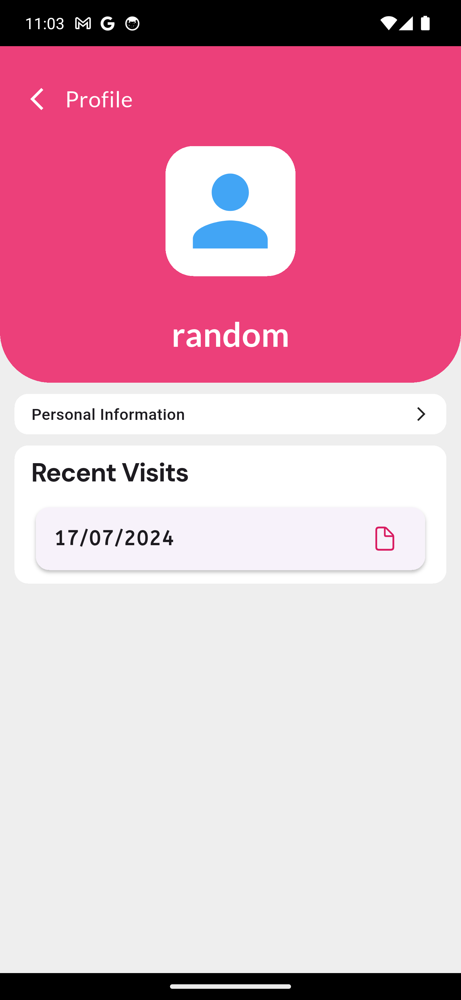
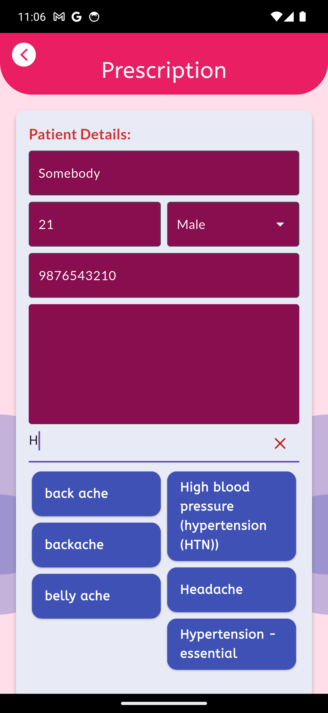
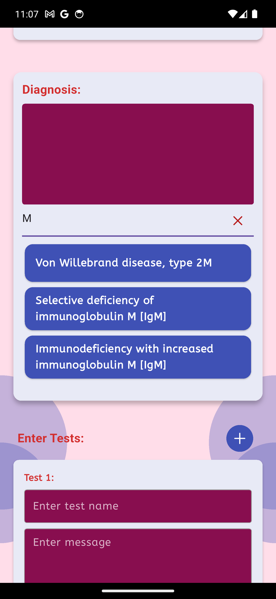

# HealthKa Doctor
## Overview

**HealthKa Doctor** is a comprehensive Flutter-based healthcare management application designed to streamline medical practice operations for doctors, clinics, and healthcare providers. This cross-platform mobile application provides an integrated solution for managing patient records, prescriptions, appointments, and clinical documentation with modern Material Design UI and robust data management capabilities.

---

## Table of Contents

- [🖼️ Screenshots](#️-screenshots)
- [🚀 Key Features](#-key-features)
- [🛠 Technical Architecture](#-technical-architecture)
- [📱 Application Structure](#-application-structure)
- [🚀 Getting Started](#-getting-started)

---
## 🖼️ Screenshots
<p>
  
  
  
  
  
  
  
  
  
</p>

## 🚀 Key Features

- **Patient Management System**
    - Patient profiles with medical history and contact information
    - Secure, searchable SQLite database
    - Multi-patient support
- **Prescription Management**
    - Digital prescription creation and editing
    - PDF generation and sharing
    - Prescription history tracking
    - Medication and dosage monitoring
- **Appointment Scheduling**
    - Schedule, view, and manage appointments
    - Calendar integration for date/time management
    - Appointment history and follow-ups
- **Doctor Profile \& Clinic Management**
    - Comprehensive doctor profiles
    - Multi-clinic support
    - Clinic notes and observations
- **Records Management**
    - Electronic medical records (EMR)
    - Secure document storage and retrieval
    - Health data tracking (vitals, history, metrics)
---
## 🛠 Technical Architecture

- **Flutter Framework**
Built with Flutter SDK (Dart), ensuring cross-platform compatibility for iOS and Android.
- **Key Dependencies**
    - `flutter`: Core SDK
    - `cupertino_icons`: iOS icons
    - `google_fonts`: Typography
    - `http`: API communication
    - `path_provider`: File system access
    - `pdf` \& `printing`: PDF generation and printing
    - `permission_handler`: Device permissions
    - `sqflite`: Local SQLite database
    - `shared_preferences`: Local storage
---

## 📱 Application Structure

- **Splash Screen**: Branding and initialization
- **Login System**: Secure authentication
- **Home Dashboard**: Metrics and navigation
- **Patient Management**: Listing, profiles, records
- **Prescription Interface**: Digital prescription tools
- **Records Archive**: Document and data storage
- **UI/UX**
    - Material Design principles
    - Responsive and adaptive layouts
    - Intuitive navigation
    - Professional healthcare aesthetics
 
---
## 🚀 Getting Started

### Prerequisites

- Flutter SDK (3.4.1+)
- Dart SDK
- Android Studio or VS Code with Flutter plugins
- (Optional) iOS development tools


### Installation

```bash
git clone https://github.com/mayankKushwaha13/healthKaDoc.git
cd healthKaDoc
flutter pub get
flutter run
```
---
**HealthKa Doctor** is a robust foundation for healthcare management, combining Flutter's cross-platform power with essential medical practice features, focusing on user experience and data security.
